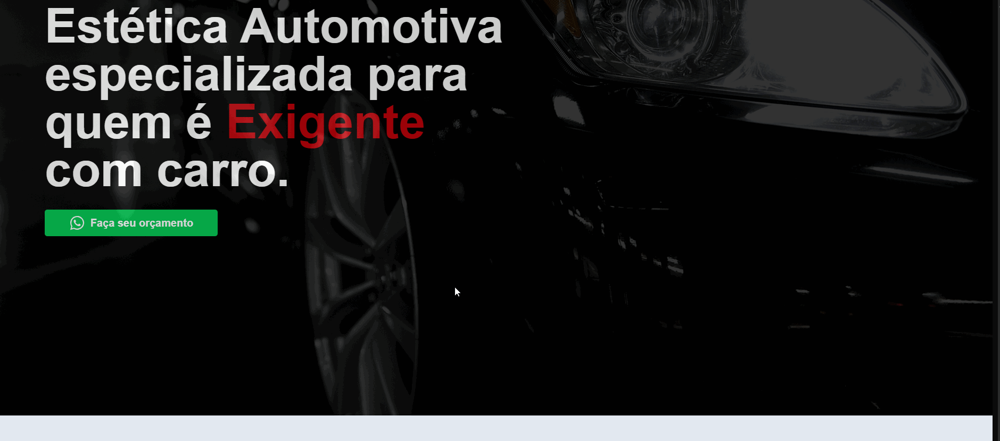

# 🚗 Landing Page - Estética Automotiva

Projeto de uma landing page moderna e responsiva feita com **Next.js**, focada em divulgação de serviços automotivos como polimento, pintura de pinças, restauração de couro e muito mais.



## 🔧 Tecnologias usadas

- [Next.js](https://nextjs.org/)
- [React](https://reactjs.org/)
- [Tailwind CSS](https://tailwindcss.com/)
- [Embla Carousel](https://www.embla-carousel.com/)
- [React Icons](https://react-icons.github.io/react-icons/)

## 🚀 Funcionalidades

- Carrossel de serviços com navegação
- Galeria de depoimentos com links
- Design responsivo para todos os dispositivos
- Estilo moderno com Tailwind
- Integração com WhatsApp para contato direto

## 📷 Preview

Acesse o projeto em produção (se tiver deploy):  
[🔗 Link do site](https://mk-landing-page.vercel.app/)

## 📦 Como rodar localmente

```bash
# Clone o repositório
git clone https://github.com/seu-usuario/seu-repo.git

# Acesse a pasta do projeto
cd seu-repo

# Instale as dependências
npm install

# Rode o projeto
npm run dev
